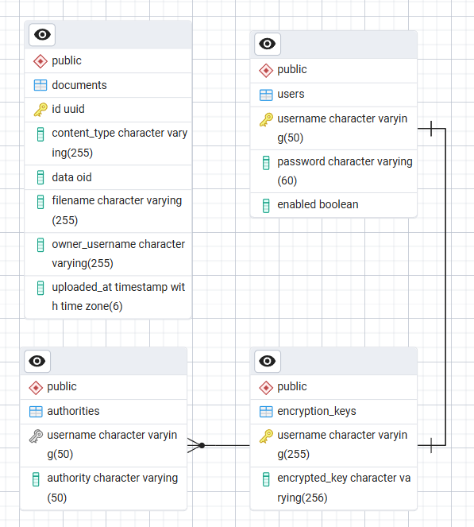

<div align="center">
    <h1>SpringVault</h1>
    <p>Enables secure uploading and encrypted storage of documents.<br>Written in Java/Spring Boot</p>
</div>

## Features

- AES-256 GCM encryption for files
- User-specific document access
- Upload, view and download documents

## Tech Stack

Built with Java 25, Spring Boot, PostgreSQL, Thymeleaf and Bootstrap 5.

## Database Schema



## Setup for Local Development

### Clone the repository

```bash
git clone https://github.com/KafetzisThomas/SpringVault.git
cd SpringVault
```

### Run the SQL script to create tables

In pgAdmin 4, open and run the script from the `sql-scripts/` directory.

https://youtu.be/3YnNkm3RDMI?si=Y15dKyQ0pJZdEEaD

If you prefer the CLI, you can use the following commands:

https://youtu.be/GiT0Dm8l_Ts?t=120&si=alCUwpcfHsVGOsO8

Learn more about pgAdmin 4:

https://www.pgadmin.org/docs/pgadmin4/latest/index.html

https://youtu.be/WFT5MaZN6g4?si=2EO9urCjijPlLeWi

### Rename and configure the application properties file

```bash
cp src/main/resources/application.properties.example src/main/resources/application.properties
```

Edit `application.properties` to update any necessary values (database config).

### Run the application (Tomcat Server)

```bash
mvn spring-boot:run
```

Access web application at http://127.0.0.1:8080 or http://localhost:8080.

## Run Tests

```bash
mvn test
```

Note: Most of these steps can be skipped if you use a full-featured IDE like IntelliJ.
